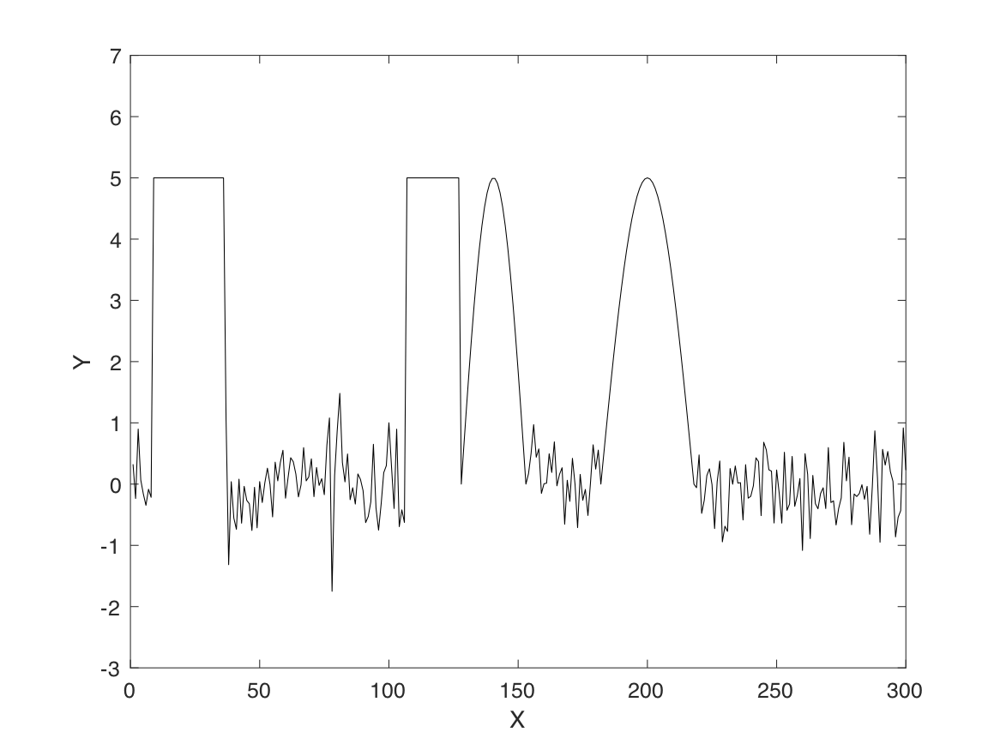
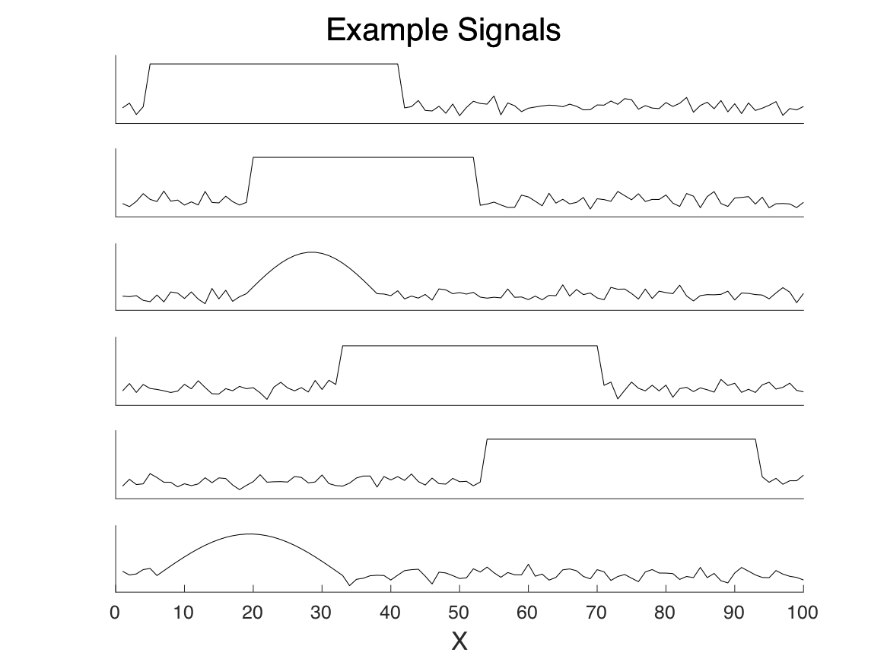

## Signal Processing

### Part 1. Signal Classification

Within 'data/week-03/week-03-chunks-data.csv' is 10,000 time series each 100 points long. There are two types of signals, a square signal and a curve signal. The goal is to write a neural network that can classify the two types of signals. Within 'data/week-03/week-03-chunks-labels.csv' are one-hot labels for the signals. Each column is associated with the same column in the data.csv, and row 1 is the curve class and row 2 is the square class.  

Think of this like the MNIST problem set, but instead of grayscale images (a 2D 'signal'), this is a time series (a 1D 'signal').

  
---
### Part 2. Signal Segmenting

Within  'data/week-03/week-03-multi-data.csv' is a single victory with 10,000 signals like the ones in the chunks above. The labels are in 'data/week-03/week-03-multi-labels.csv'. The goal of this is to determine which class each point in the vector belongs to. The classes are square, curve, and white noise. In the label file, row 1 = white noise, row 2 = curve, row 3 = square.

  
